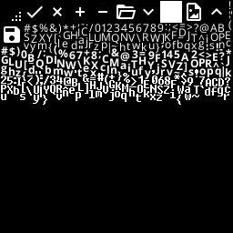

# Atlasser
The atlasser for the microui/neocogi UI


## Build

Small size build

```
cargo +nightly build --release -Z build-std=std,panic_abort -Z build-std-features=panic_immediate_abort --target x86_64-unknown-linux-gnu
```

## Usage
Run the following command:
```
 cargo run --release -- -a 256 --icon-path ./assets/ --font ./assets/NORMAL.ttf --size 12 --font ./assets/BOLD.ttf --size 12 --font ./assets/CONSOLE.ttf --size 16 --png-file ./atlas.png 
```

This will generate `atlas_data.rs`, that you can copy to your neocogi/src/ui folder. And can be used to make a UI:

The folder structure requires icons with the same names as we have and the required fonts are `BOLD.ttf`, `NORMAL.ttf` and `CONSOLE.ttf`
